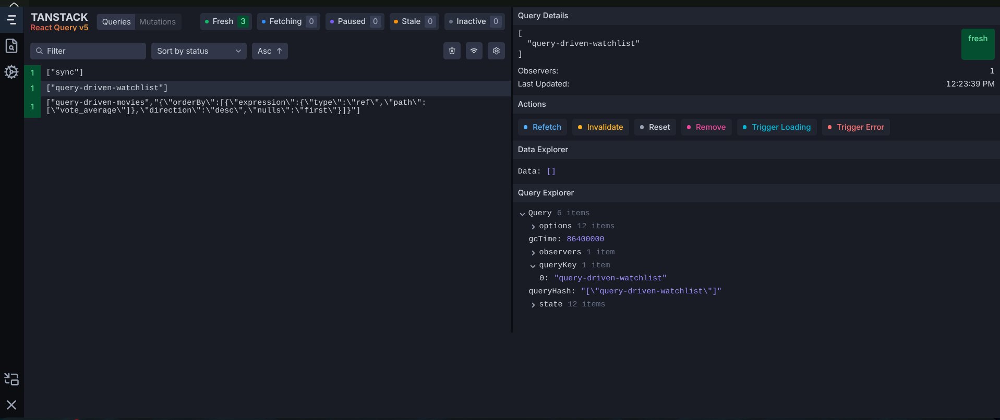

# Tanstack DB in action

The team at tansack, makers of tanstack query aka react-query partnered with the [ElectricSQL](https://electric.ax/) team to give us s ething truly awesome

This library excites me for 2 reasons

### Joining data from multiple sources

Anything you can express as a collection can be joined to another collection with sql like semantics and te library auotmtically jandles mitigating against N+ 1 querues

```ts
// Left join - all users, even without posts
const allUsers = createLiveQueryCollection((q) =>
  q
    .from({ user: usersCollection })
    .leftJoin({ post: postsCollection }, ({ user, post }) => eq(user.id, post.userId)),
);
```

### Basic local first functionality

The library shipped persistence in its latest version backed by sqlite with web and react native adapters enabling for some true local first approaches all of which s porvider and backend agnostic

In my usage of the library I have discoverd a few cool apporaches that make lie with this llbrary better

## The basics

Tanstack db comes with adapters for many local first providers but in our case we'll be using the tanstack query one since it lets us progresivelly enhance

Let's take the example of a movie app

```tsx
import { useQuery } from "@tanstack/react-query";

export function MovieListWithUseQuery() {
  // TODO: add filters from url search params
  const filters = {
    page: 1,
    perPage: 10,
    q: "",
    sortBy: "vote_average",
    sortDirection: "desc",
    includeTotal: true,
  } as const;
  const { data, isLoading } = useQuery({
    queryKey: ["movies-with-use-query"],
    queryFn: () =>
      getPaginatedFakeMoviesFn({
        data: filters,
      }),
  });

  return (
    <div className="w-full flex flex-col">
      <h1 className="text-2xl font-bold">Movies</h1>
      {isLoading ? (
        <div>Loading...</div>
      ) : (
        <div>
          {data?.items.map((movie) => (
            <div key={movie.id}>{movie.title}</div>
          ))}
        </div>
      )}
    </div>
  );
}
```

This is a nice starting point for us to port and we start by creating the collection definition

```ts
export const moviesCollection = createCollection(
  queryCollectionOptions({
    queryKey: [PAGINATED_MOVIES_COLLECTION_QUERY_KEY],
    queryFn: async (ctx) => {
      const filters = {
        page: 1,
        perPage: 10,
        q: "",
        sortBy: "vote_average",
        sortDirection: "desc",
        includeTotal: true,
      } as const;
      const response = await getPaginatedFakeMoviesFn({
        data: filters,
      });
      return response;
    },
    select: (data) => data.items,
    queryClient: getQueryClient(),
    getKey: (item) => item.id,
    autoIndex: "eager",
    defaultIndexType: BasicIndex,
    staleTime: 1000 * 60 * 60,
  }),
);
```

And we can query our collection via a useLiveQueryHook

```tsx
import { useLiveQuery } from "@tanstack/react-db";
import { queryDrivenMoviesCollection } from "../query-driven-collection";

export function MovieList() {
  const { data, isLoading } = useLiveQuery((qb) =>
    qb.from({ movies: moviesCollection }).orderBy(({ movies }) => movies.vote_average, "desc"),
  );

  return (
    <div className="w-full flex flex-col">
      <h1 className="text-2xl font-bold">Movies</h1>
      {isLoading ? (
        <div>Loading...</div>
      ) : (
        <div>
          {data?.map((movie) => (
            <div key={movie.id}>{movie.title}</div>
          ))}
        </div>
      )}
    </div>
  );
}
```

For now this seems like a downgrade compared to the previous setup as it requires more boiler plate and if you've noticed we're not passing the filters to gte a new paginated subset.

While tansack db can handle upto 50,000 rows no problem our backend team or third party APIs would never allow us to grab that many records at once and we'll explore solution to thta later but for now let's do something that the `useQuery` can't

```ts
//  watchlist collection
export const watchlistCollection = createCollection(
  queryCollectionOptions({
    queryKey: [WATCHLIST_COLLECTION_QUERY_KEY],
    queryFn: async () => getFakeWatchlistFn(),
    queryClient: getQueryClient(),
    schema: fakeWatchlistSchema,
    getKey: (item) => item.id,
    autoIndex: "eager",
    defaultIndexType: BasicIndex,
    staleTime: 1000 * 60 * 60,
    onInsert: async ({ transaction }) => {
      await Promise.all(
        transaction.mutations.map((mutation) =>
          addFakeWatchlistFn({
            data: {
              id: mutation.modified.id,
              movieId: mutation.modified.movieId,
              createdAt: mutation.modified.createdAt,
            } satisfies FakeWatchlistItem,
          }),
        ),
      );
    },
    onDelete: async ({ transaction }) => {
      await Promise.all(
        transaction.mutations.map((mutation) =>
          removeFakeWatchlistFn({ data: { id: String(mutation.key) } }),
        ),
      );
    },
  }),
);
```

> Join on another collection

```tsx
import { eq, isUndefined, not, useLiveQuery } from "@tanstack/react-db";
import { moviesCollection, watchlistCollection } from "../query-driven-collection";

export function MovieList() {
  const { data, isLoading } = useLiveQuery((qb) =>
    qb
      .from({ movies: queryDrivenMoviesCollection })
      .join({ watchlist: watchlistCollection }, ({ movies, watchlist }) =>
        eq(movies.id, watchlist.movieId),
      )
      .orderBy(({ movies }) => movies.vote_average, "desc")
      .select(({ movies, watchlist }) => ({
        id: movies.id,
        title: movies.title,
        overview: movies.overview,
        poster_path: movies.poster_path,
        vote_average: movies.vote_average,
        release_date: movies.release_date,
        watchlistId: watchlist.id,
        onWatchlist: not(isUndefined(watchlist)),
      })),
  );

  return (
    <div className="w-full flex flex-col">
      <h1 className="text-2xl font-bold">Movies</h1>
      {isLoading ? (
        <div>Loading...</div>
      ) : (
        <div>
          {data?.map((movie) => (
            <div key={movie.id}>{movie.title}</div>
          ))}
        </div>
      )}
    </div>
  );
}
```

This is not impossible to accomplish in `useQuery` land but it is not as incrementally computed and it it certainly not as clean and the comparisons can take a back seat for now as we examine how to do partial data responses and how to hnadle non array responses becsue if you notice

```ts
      const response = await getPaginatedFakeMoviesFn({
        data:filters
      });
      return response; // this response is an object and checking the query devtools will show the whole payload but tansack db only allows you to return an array so we use the slect method below similar to the tansack query equivalent
    },
    select: (data) => data.items, // only return the items array from the collection
```



This mean we cna grab the rest of the metadata from the query store and i made a handy helper for this

```ts
import { useQueryClient } from "@tanstack/react-query";

export type MetaObject<T = unknown> = {
  items: T[];
  page?: number | undefined;
  perPage?: number | undefined;
  q?: string | undefined;
  totalItems?: number | undefined;
  totalPages?: number | undefined;
};

export type DBQueryMetaObject<T> = {
  queryKey: readonly unknown[] | undefined;
  meta: MetaObject<T> | undefined;
};

export type TSDBQueryMetaMatch = {
  page?: number;
  q?: string;
};

export function useTSDBQueryMeta(queryKey: string, match?: TSDBQueryMetaMatch) {
  const qc = useQueryClient();
  const queriesData = qc.getQueriesData({ queryKey: [queryKey] });

  const metaObject = parseAndFindMetaObject(queriesData, queryKey, match);
  return metaObject;
}

export function parseAndFindMetaObject<T>(
  queryData: [readonly unknown[], unknown][],
  queryKey: string,
  match?: TSDBQueryMetaMatch,
) {
  const candidates = queryData.filter(([, data]) => isMetaObject(data));

  const keyed = candidates.filter(([key]) =>
    key.some((part) => typeof part === "string" && part.includes(queryKey)),
  );

  const pool = keyed.length > 0 ? keyed : candidates;

  const matched = match
    ? pool.find(([, data]) => metaMatches(data as MetaObject, match))
    : undefined;

  const metaObject = matched ?? pool.at(-1);

  if (!metaObject) {
    return {
      queryKey: undefined,
      meta: undefined,
    };
  }

  return {
    queryKey: metaObject[0],
    meta: metaObject[1] as MetaObject<T>,
  } satisfies DBQueryMetaObject<T>;
}

function isMetaObject(data: unknown): data is MetaObject {
  return (
    !!data &&
    typeof data === "object" &&
    "items" in data &&
    Array.isArray((data as MetaObject).items)
  );
}

function metaMatches(data: MetaObject, match: TSDBQueryMetaMatch) {
  if (match.page != null && data.page != null && data.page !== match.page) {
    return false;
  }

  const wantedQ = (match.q ?? "").trim();
  const cachedQ = (data.q ?? "").trim();
  if (wantedQ !== cachedQ) {
    return false;
  }

  return true;
}

// usage
const { meta } = useTSDBQueryMeta(PAGINATED_MOVIES_COLLECTION_QUERY_KEY, {
  page,
  q,
});
// meta.page
// meta.totalItems
// meta.totalPages...
```

## Pagination

If your server does return the massive patload you can leverage the `useLiveInfinteQuery` hook to do cursor based pagination of the dataset that has already been fetched

```tsx
import { useLiveInfiniteQuery } from "@tanstack/react-db";
import { useState } from "react";
import ResponsivePagination from "react-responsive-pagination";

export function ListMoviesInfinite() {
  const { isLoading, fetchNextPage, pages, pageParams, hasNextPage, state } = useLiveInfiniteQuery(
    (q) =>
      q.from({ movies: moviesCollection }).orderBy(({ movies }) => movies.vote_average, "desc"),
    {
      initialPageParam: 0,
      pageSize: 200,
      getNextPageParam: (lastPage, allPages) =>
        lastPage.length === 200 ? allPages.length : undefined,
    },
  );

  const latestPage = pageParams.at(-1);
  const [currentPage, setCurrentPage] = useState(latestPage ?? 0);
  const currentPageData = pages[currentPage];

  async function handleLoadMore() {
    setCurrentPage((prev) => (latestPage ?? prev) + 1);
    fetchNextPage();
  }

  return (
    <div className="w-full h-full flex flex-col gap-4">
      <div className="w-full h-full flex justify-end items-center gap-4">
        <div className="max-w-[90%] w-full ">
          <ResponsivePagination
            current={currentPage}
            total={latestPage ?? 1}
            onPageChange={(page) => setCurrentPage(page)}
          />
        </div>
        <Button onClick={handleLoadMore} disabled={!hasNextPage}>
          Load more
        </Button>
      </div>
      <div className="w-full h-full flex flex-col gap-4">
        <MoviesTable data={currentPageData} isLoading={isLoading} />
      </div>
    </div>
  );
}
```

This works but it doenst give us ultimate control which is unoked via a feature released in `0.5` called [query-driven-sync](https://tanstack.com/blog/tanstack-db-0.5-query-driven-sync)

To achive this we set the collection sync option to `on-deman`

> [!NOTE]
> This will opt us out of the ability to preload a collection in the loaders [more info](https://tanstack.com/intent/registry/%2540tanstack%252Fdb/meta-framework#on-demand-query-collection-preload)

```ts
import { parseWhereWithHandlers } from "@/lib/tanstack/db/utils";
import { BasicIndex, createCollection, parseLoadSubsetOptions } from "@tanstack/db";
import { queryCollectionOptions } from "@tanstack/query-db-collection";

export const PAGINATED_MOVIES_COLLECTION_QUERY_KEY = "query-driven-movies";
export const WATCHLIST_COLLECTION_QUERY_KEY = "query-driven-watchlist";

const MOVIE_SORT_KEYS = [
  "title",
  "overview",
  "vote_average",
  "release_date",
  "popularity",
] as const;

type MoviesWhereClause = {
  page?: { _eq: number };
  q?: { _eq?: string; _ilike?: string };
};

function parseSearchQ(where: MoviesWhereClause | null | undefined) {
  const raw = where?.q?._eq ?? where?.q?._ilike;
  if (!raw) return undefined;
  const stripped = raw.replace(/^%|%$/g, "").trim();
  return stripped || undefined;
}

export const queryDrivenMoviesCollection = createCollection(
  queryCollectionOptions({
    queryKey: [PAGINATED_MOVIES_COLLECTION_QUERY_KEY],
    queryFn: async (ctx) => {
      const where = parseWhereWithHandlers<MoviesWhereClause>(ctx.meta?.loadSubsetOptions?.where); //this will now be available
      const { sorts } = parseLoadSubsetOptions(ctx.meta?.loadSubsetOptions);
      const page = where?.page?._eq ?? 1;
      const q = parseSearchQ(where);
      const primarySort = sorts[0];
      const { sortBy, sortOrder: sortDirection } = resolveSortOrder({
        sortBy: primarySort ? String(primarySort.field.at(-1)) : undefined,
        sortOrder: primarySort?.direction,
        allowedKeys: MOVIE_SORT_KEYS,
        defaultSortBy: "vote_average",
        defaultSortOrder: "desc",
      });
      const response = await getPaginatedFakeMoviesFn({
        data: { page, perPage: 10, q, sortBy, sortDirection, includeTotal: true },
      });
      return response;
    },
    select: (data) => data.items,
    queryClient: getQueryClient(),
    getKey: (item) => item.id,
    autoIndex: "eager",
    defaultIndexType: BasicIndex,
    syncMode: "on-demand",
    staleTime: 1000 * 60 * 60,
  }),
);
```

The query parsing helpers
